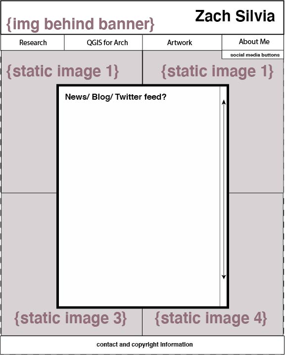

# My Name
Fall 2020 log

## October 19

What I did:
- Watched the "What is a computer" related vids
- Signed up for GitHub
- Installed Atom
- Watched the Harvard video - dude had weird energy

Questions/ideas:
- Treat my own computer better.

## November 2

What I did:
- Worked on my GIS data. Approx. 10 hours.
- Worked on DS related arch resources
- Began a DS bibliography for archaeology

Questions/ideas:
- Workshop ideas following meeting.
- Command line? Command line...

Other updates:
- ASOR next week! Which means my paper won't be my time enemy for much longer.

## November 16

What I did:
- Participated in the archaeology workshop 'Best Practices for Digital Scholarship (Workshop)' at the annual American Schools for Oriental Studies meeting. Five panelists and many discussants addressing methods, best practices, ethics, and problems of mass data storage, collaboration, mass data dissemination, open source archaeological data, "in the field" problems like an increased reliance on digital tools in the field but where real-world factors like limited electricity and internet inhibit workflow.
- Finished cleaning my GIS data, producing a more robust framework for querying this data, and then digitized three archaeological surveys according to this new framework. Currently +750 archaeological sites mapped in QGIS. Re: cleaning - my attribute table was inconsistent, which meant that querying data and producing valuable analytics would have been incomplete. Approx 40 hours.
- "What is the internet related vids"
- Command line revisited
- Began DH for humanities tutorial
- Began AutoGIS tutorial
- Explored various options for working with python (within Atom, Anaconda, within QGIS itself)
- Installed packages in Atom: terminus, run-python-simply, build-python, build, atom-python-run, busy-signal,
- Downloaded Anaconda and watched tutorials about creating environments. Checked version installation using command line, but I think there is a problem. Several versions of Python installed and the one associated with Anaconda is not the one recognized through % python in command line (it should read Python 3.6 |Anaconda..., etc| but instead only Python 2.7.16 opens as default (which is a problem because I already thought I was using Python 3.8).
- Spent more time familiarizing myself with GitHub
- Thought about the page we will develop. Ideas: professional website (academic and art); open sourcing my own research GIS data and bibliography at end of dissertation; Open source QGIS project in progress.

Questions/ideas:
- Some new resources to add for archaeology based on the workshop I attended. The discipline of archaeology seems to have two major problems - 1) data management and storage; 2) sharing data related issues (legibility for collaborators, channels for mass data sharing, "in the field" practical problems).
- Question for myself: how can I foreshadow and address some of the issues discussed in this workshop and incorporate them into my own work before they become a future problem?
- How can I not overwhelm/fatigue myself, especially when my computer does not do things the way my tutorials say they will. It feels hopeless even with troubleshooting on stack, google, and GitHub!

Other updates:
- N/A

## November 30
- Met with Alice on Nov 20
- Watched two AutomateGIS tutorials, entry level Jupyter (looked at interface), ready to start python
- Added some info to existing html sandbox packages
- Watched a video about wireframe basics
- Draft Wireframe of actual professional page
- reviewed slides from previous Session
- html basics on w3schools
- Food coma from Nov 26-28.

- Wireframe:
- 

## December 14

What I did:
- Worked on professional website using an HTML5 Template
  - tried to upload to domain of one's own, but cannot get the page to display. Also a problem with one of the tabbed links.
- QGIS and Python: Learned how to access features and attributes within a layer using the Python Console. Learned how to find the coordinates of features within a layer. Entered these instructions in QGIS for Archaeologists document reflecting what was learned.
- Completed Lesson 1 in AutomatingQGIS class. Learned how to create points, lines, polygons, define a boundary, create shapes with holes in them all with shapely using Jupyter.
- Workshop ideas:
  - 1) QGIS for Archaeology, Classics, and HART students: An Introduction. Why GIS?
    - This session would be a very basic overview of GIS. What are its applications? How do people use it? And specifically, why is GIS an important tool for students in the humanities? What can archaeology, classics, and history of art students gain from learning GIS basics?
  - 2) QGIS: Creating your first map.
    - Raster vs. Vector maps. Working with historical maps vs. vector maps.
    - Coordinate systems, layers, attribute tables, points, and polygons.

Questions/ideas:
- None this week.

Other updates:
- N/A

## January 21
What I did:
- Worried about the insurrection and fallout.
- The Python tutorial course I was working on didn't work out. After a few lessons the course required the use of proprietary software for Python coding, which isn't a big deal except for the fact that the lessons were provided in that software. There was no accessible data for me to really practice with. What I have done is just resorted to the basic tutorials available through https://www.qgistutorials.com/. This actually worked out quite well and I have been learning how to do automate some basic workflow processes that I would otherwise do in the GUI interface. Some of the actions are not things I will probably use, but I feel like it is a) good practice because I know what result to expect (like analyzing my attribute table, connecting points, measuring lines), and 2) is basic enough to understand at my learning level.
- I have also been following the geopandas tutorials through https://geopandas.org/.
- I put some thought into my workshop, which I really think should be a series of GIS workshops. The writeup for this is below (written as an advertisement for this workshop and series). Since the semester starts much later, I think Feb 18 is probably the earliest day to hold the first session.
  - This first session will be an introduction to GIS. I have the session outlined, have started to put together slides, and have thought about the presentation flow. The overall goal of the introduction is to introduce key GIS concepts in a way that makes GIS relevant to the undergraduate community. I've put some thought into the sorts of projects students in both Arts and Sciences might use GIS for. The examples of GIS basics and tools given in the rest of the session are chosen with these types of projects in mind.
  - The first session will be more of a lecture than interactive lesson. The following three are to be completely interactive lessons and are all tasks I am already equipped to teach.
  - These sessions are (tentatively):
    - Session 2: Making a basic map: points, lines, polygons, basemaps, and your attribute table.
    - Session 3: Obtaining maps for free (natural earth and satellite imagery) and making a digital elevation model.
    - Session 4: Georeferencing historical maps.

The Workshop:
  Practical Geographic Information Systems (GIS)
  Zach Silvia
  Digital Scholarship Graduate Fellow
  Feb 18?

	Making a nice map for your final project often feels like a daunting task. You download Google Earth, you mark a few blobs on the earth that look like the right spot, then you screenshot the result. But it doesn’t really come out the way you planned.

  There is a better way! With a little bit of effort you can learn how to make nice looking maps that actually enhance your research project and open new avenues for data analysis. You need to learn the basics of Geographic Information Systems (GIS).

  I know, it isn’t the most exciting name – but trust me, this is a powerful tool for spatial analysis. It is also a great item to have on your C.V. Maybe you are a History of Art major who would like to map the origins of art objects in a museum collection. Maybe you are a geology student who would like to map coastal erosion in Long Island. Maybe you are a Classics student who would like to visualize the major literary hubs of the ancient world. If you are an Archaeology, Cities, or Geology student – you will probably need to know the basics.

  This workshop is the first in a series of [3-4] sessions aimed towards promoting the use of Geographic Imaging Systems (GIS) in the Arts and Sciences. We will focus on the open-source, completely free GIS app known as QGIS and learn some of the most basic GIS tools so you can make your maps better. The first session will feature an overview of the two major GIS applications – QGIS and ArcGIS. We will talk about the merits of both programs so you can decide which is best for you. We will talk about some key GIS concepts and analytical tools that you can use in either program.

Lightning talk:
  - Remote sensing with the Semi-Automatic Classification (SCP) Plug-in for QGIS.
    - This talk will be an over view of basic land classification techniques using the SCP tool. I will show how I've obtained multi-spectral satellite imagery, used this remote sensing tool to classify land coverage in my area of interest, and talk about the archaeological applications of this technique and tool. I have not been totally successful with this just yet, but I am close.

---

## Markdown

```
# First-level heading

## Second-level heading

1. Ordered list
2. ordered list

- Unordered list
- Unordered list

Use multiple returns or consecutive lines
will run together

*Italics* or **Bold**

```

# First-level heading

## Second-level heading

1. Ordered list
2. ordered list

- Unordered list
- Unordered list

Use multiple returns or consecutive lines
will run together

*Italics* or **Bold**
