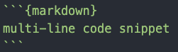

# Editing instructions

[Session notes](#updating-session-notes)

[Individual updates](#individual-updates)

[Markdown guide](#markdown-guide)

## Updating session notes

1. On GitHub, navigate to the [sessions directory](https://github.com/digbmc/dsgf-20-21/tree/master/sessions). Make sure you are on the **master** branch.

2. Download the markdown file for the relevant session.

3. Use Markdown syntax to add your own notes. Save the document without changing the original filename.

4. Return to GitHub and switch to your personal branch. Upload the file to the sessions directory. Add a short, descriptive message.

5. Navigate to **Pull requests** and click **new pull request**

6. Select master as your base branch and your personal branch as your compare branch.

7. Select **Create pull request** and write a brief summary of the changes (i.e. 'notes from 10/19 session'). No need to close the pull request -- I will review it and then close it to integrate your changes.

## Individual updates

- On GitHub, navigate to the [**logs** folder](https://github.com/digbmc/dsgf-20-21/tree/master/logs). Use the branch dropdown menu (labeled **master**) to switch to your personal branch or create a new one with a short, unique name that includes your initials.

- Download your log file (click **Raw** and then **save as** wherever you keep your files for this group). Do not change the filename. It's also fine to use your local copy, as long as it's up to date.

- Open it up in your text editor and add any relevant updates for the week. Pay attention to the syntax highlighting in Atom and refer to the [guide below](#markdown-guide)

- When you're done, return to the **logs** folder on the GitHub repository. Make sure you are on your personal branch. Select **Add file** and **Upload files**

- Write a brief comment to summarize your change (i.e. 'updates for 10/19') and select **commit changes**

- Your updates will only be visible on your personal branch (though I can still review them). If you'd like to merge them with the main branch, create a **pull request**, but do not close it.


## Markdown guide

# First-level heading

`# First-level heading`

## Second-level heading

`## Second-level heading`

### Third (and so forth)

`### Third (and so forth)`

1. Ordered list item
2. Ordered list item
5. It just has to be an integer

```{markdown}
1. Ordered list item
2. Ordered list item
5. It just has to be an integer
```

- Unordered list item
- Another unordered list item

```{markdown}
- Unordered list item
- Another unordered list item
```

[hyperlink text](www.hyperlink.com) `[hyperlink text](www.hyperlink.com)`

Use multiple returns or consecutive lines
will run together

*Italics*  - `*Italics*` and  **Bold** - `*Bold*`

Short `code snippet`

```
Short `code snippet`
```

```{markdown}
multi-line code snippet
```



\* \# escape characters (without markdown function) `\* \# `
